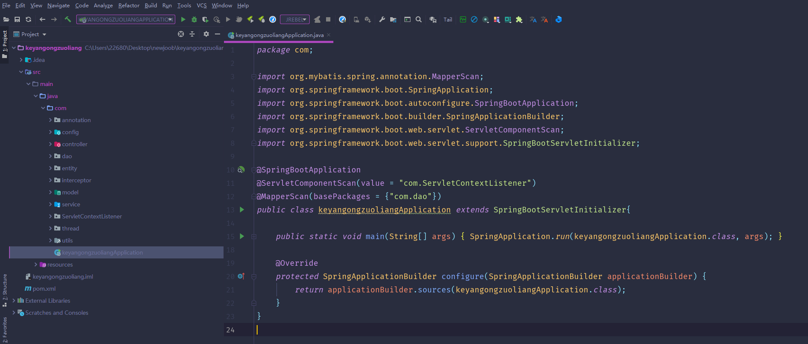
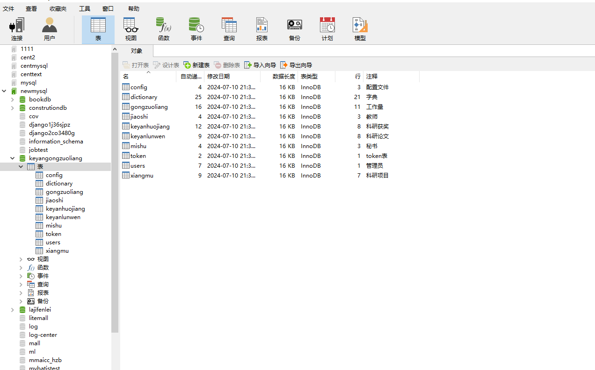
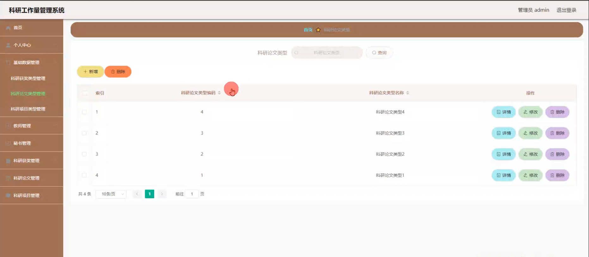
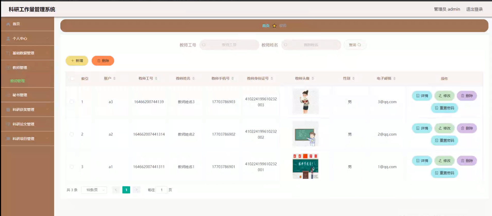
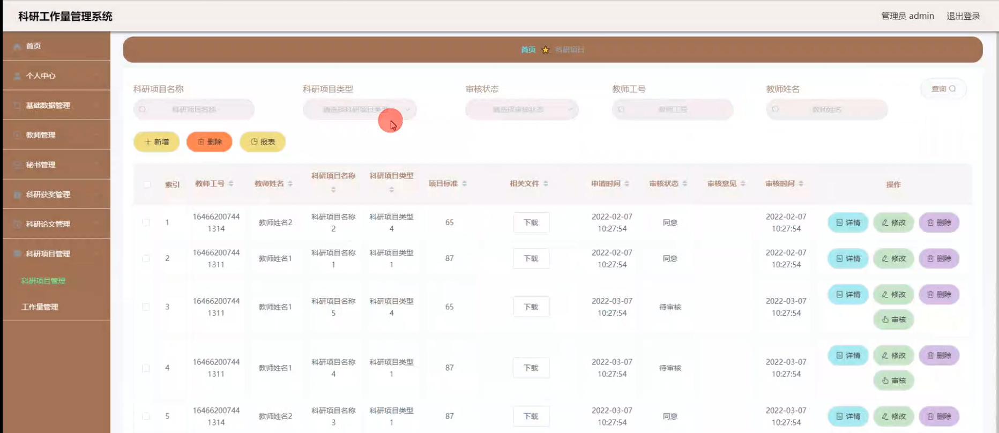
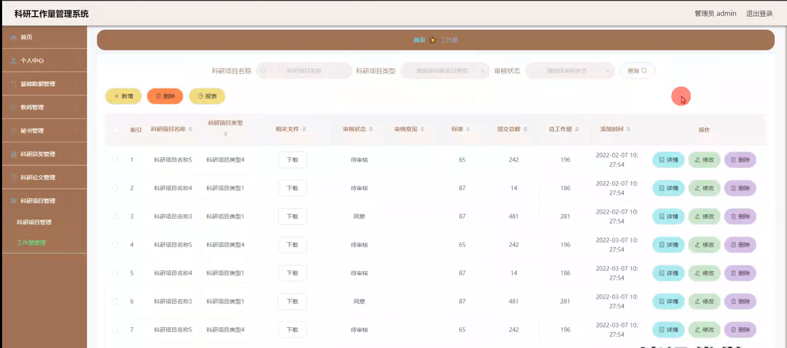
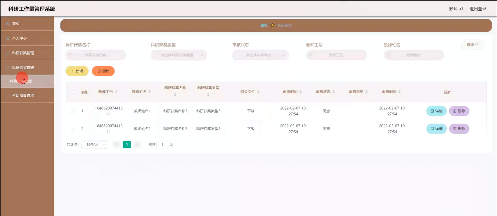
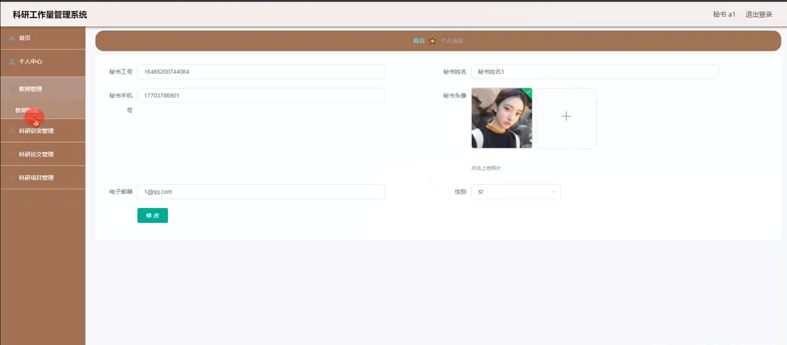
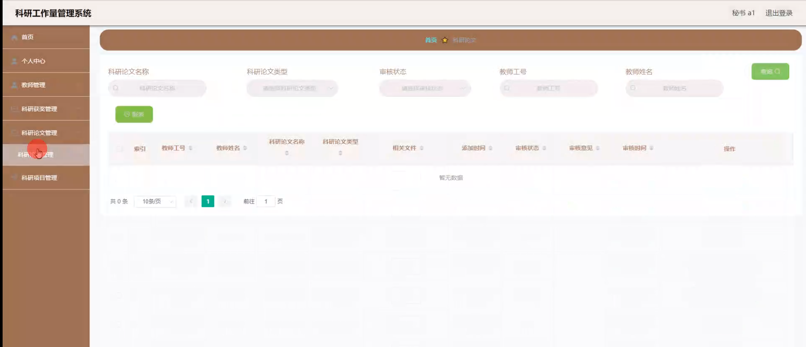

# 基于springboot的科研工作量管理系统

---
### 👉作者QQ ：1556708905 微信：zheng0123Long (支持定制修改、部署调试、定制毕设)

### 👉接网站建设、小程序、H5、APP、各种系统等

---

#### 介绍

在科研工作日益重要的背景下，为了更高效、准确地管理科研人员的工作量，提高科研管理的规范化和科学化水平，我们开发了这套基于 Spring Boot 的科研工作量管理系统。该系统旨在为学校、科研机构等提供一个全面、便捷的科研工作量管理解决方案，促进科研工作的顺利开展和发展。

#### 技术栈

后端技术栈：Springboot+Mysql+Maven

前端技术栈：Vue+Html+Css+Javascript+ElementUI

开发工具：Idea+Vscode+Navicate

#### 系统功能介绍

（一）管理端  
个人中心：管理端用户可以在个人中心查看和修改自己的个人信息，以及系统的操作记录和通知。  
基础数据管理：对系统所需的基础数据进行维护和管理，如学科分类、科研项目类型、论文级别等，为后续的科研工作量计算和评估提供标准和依据。  
教师管理：对教师的基本信息进行管理，包括添加、修改、删除教师信息，以及查看教师的科研工作履历和业绩等。  
秘书管理：对秘书的相关信息进行管理，包括权限设置、工作分配等。  
科研获奖管理：记录和管理教师的科研获奖情况，包括奖项名称、级别、获奖时间、获奖人员等，并能够根据设定的规则计算相应的工作量。  
科研论文管理：对教师发表的科研论文进行管理，包括论文题目、期刊名称、发表时间、作者排序等信息的录入和维护，同时根据论文的级别和影响力计算工作量。  
科研项目管理：对科研项目进行全面管理，包括项目的申报、立项、结题等过程的跟踪，以及项目经费、参与人员、研究成果等信息的记录和评估，以此计算项目所产生的工作量。  

（二）秘书端  
个人中心：同管理端，秘书可以在个人中心进行个人信息的查看和修改等操作。  
教师管理：协助管理教师的相关信息，如更新教师的联系方式、工作变动情况等。  
科研获奖管理：负责录入和更新教师的科研获奖信息，确保数据的准确性和及时性。  
科研论文管理：对教师的科研论文进行初审和信息录入，为后续的评估和工作量计算做准备。  
科研项目管理：协助管理科研项目的相关事务，如收集项目进展报告、督促项目结题等。  

（三）教师端  
个人中心：教师可以在个人中心查看自己的个人信息和科研工作记录。  
科研获奖管理：教师自己申报科研获奖情况，并查看审核进度和结果。  
科研论文管理：教师上传自己发表的科研论文信息，跟踪审核状态。  
科研项目管理：教师申报科研项目，查看项目的审批进度和自己参与项目的情况。  

#### 系统作用

提高管理效率和精度  
自动化处理大量的科研数据，减少人工操作和计算错误，提高管理的效率和准确性。  
促进公平公正  
基于统一的标准和规则计算科研工作量，确保评价的公平性和客观性。  
激励科研积极性  
教师能够清晰了解自己的科研成果和工作量，激发其进一步开展科研工作的积极性。  
优化资源配置  
管理端可以根据系统数据，合理分配科研资源，支持重点项目和有潜力的研究方向。  
提升决策科学性  
为管理部门提供全面、准确的数据支持，有助于制定更科学合理的科研政策和发展规划。  

#### 系统功能截图

代码结构

数据库表

登录

基础数据管理

教师管理

科研项目管理

工作量管理

科研获奖管理

秘书端个人信息

科研论文管理

#### 总结

基于 Spring Boot 的科研工作量管理系统，通过明确管理端、秘书端和教师端的功能分工，实现了科研工作量管理的信息化、规范化和科学化。该系统有助于提高科研管理水平，激发科研创新活力，推动科研事业的蓬勃发展。

#### 使用说明

创建数据库，执行数据库脚本 修改jdbc数据库连接参数 下载安装maven依赖jar 启动idea中的springboot项目

后台登录页面
http://localhost:8080/keyangongzuoliang/admin/dist/index.html

管理员				账户:admin 		密码：admin

秘书				账户:a1 		密码：123456

教师				账户:a2 		密码：123456